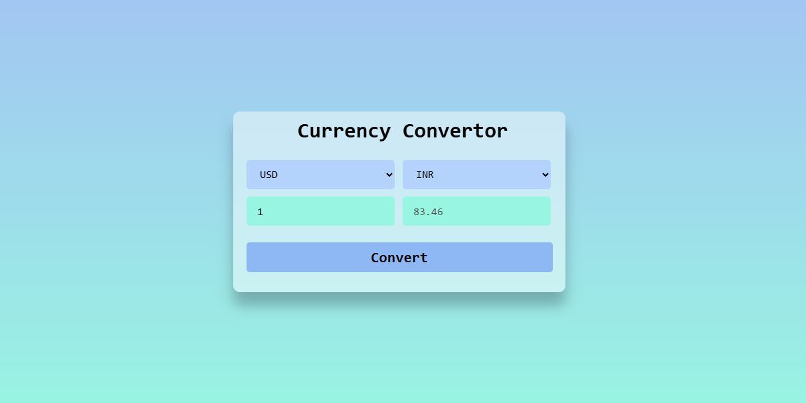

<h1>Currency Convertor</h1>

Simple Currency Convertor written in HTML, CSS, and JavaScript .

### Use of the Project:

It is used to calculate the exchange rate between different currencies. It is crucial for international trade, travel, and finance, allowing businesses and individuals to convert one currency into another based on current exchange rates.

<h3>Used Technologies</h3>
<ul>
  <li>HTML5</li>
  <li>CSS3</li>
  <li>JavaScript</li>
</ul>

<h3> ScreenShot </h3> 

  
